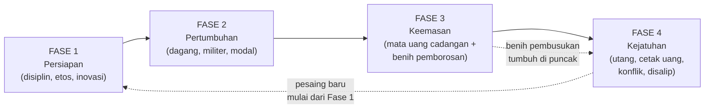

# Pola Keruntuhan Negara: Siklus Hidup Kekaisaran, Uang, dan Posisi Amerika Serikat

> **Riset mendalam** atas pertanyaan: *Apakah ada pola berulang dalam siklus negara adikuasa — dari persiapan, pertumbuhan, keemasan, hingga kejatuhan — seperti yang terlihat pada Portugal, Belanda (VOC), Inggris, dan apakah AS akan mengalami hal yang sama? Termasuk benang merah pemborosan di masa jaya, penurunan nilai uang (debasement koin emas dulu → QE sekarang).*
>
> Disusun: September 2026. Bersifat analitis-historis, **bukan nasihat keuangan atau ramalan pasti.**

---

## Ringkasan Eksekutif (TL;DR)

1. **Intuisi Anda benar dan sudah lama diteliti.** Model 4-fase yang Anda bangun (persiapan → pertumbuhan → keemasan → kejatuhan) sejajar dengan lima kerangka ilmiah besar: **Sir John Glubb** (siklus 6 tahap, ±250 tahun), **Ray Dalio** ("Big Cycle" mata uang cadangan), **Paul Kennedy** (*imperial overstretch*), **Joseph Tainter** (keruntuhan karena kompleksitas), dan **Peter Turchin** (teori struktural-demografis). Mereka berangkat dari disiplin berbeda tapi menemukan pola yang mirip.

2. **Ada "mesin" penyebab yang berulang**, bukan sekadar kebetulan: keunggulan awal (etos kerja, pendidikan, inovasi) → dominasi dagang & militer → kemakmuran → **hilangnya disiplin** (fiskal, moral, sosial) → utang & pembiayaan lewat pencetakan/penurunan nilai uang → hilangnya daya saing → pesaing baru menyalip → keruntuhan relatif.

3. **Benang merah uang yang Anda lihat itu nyata.** Dari **denarius Romawi** (kadar perak 95% → 0,5% dalam ~250 tahun), **"price revolution" perak Spanyol**, hingga **debasement** koin di banyak kekaisaran — polanya identik: negara yang kehabisan disiplin fiskal akan "menipu" lewat uangnya. **QE adalah versi modern dari mekanisme yang sama secara fungsi (memonetisasi tekanan fiskal), tapi berbeda secara mekanik** — dan perbedaan mekanik itu penting (lihat Bagian 4).

4. **AS menunjukkan banyak penanda fase akhir** (utang ~123% PDB, share dolar di cadangan global di titik terendah 30 tahun ~57%, polarisasi internal, ketergantungan pada pencetakan uang) — **tetapi juga punya penangkal unik** yang belum pernah dimiliki kekaisaran mana pun (dominasi teknologi/AI, kedalaman pasar modal, demografi imigran, militer tak tertandingi, "hak istimewa berlebih" dolar). Kesimpulan jujur: **AS ada di fase transisi keemasan-akhir menuju kejatuhan *relatif*, bukan keruntuhan mendadak.** Yang runtuh biasanya *dominasi relatif*, bukan negaranya lenyap.

5. **Peringatan metodologis (penting):** teori siklus punya kelemahan serius — *survivorship bias*, determinisme, dan pencocokan pola secara *hindsight*. Gunakan sebagai **lensa** dan **checklist indikator**, bukan sebagai ramalan mekanis. Bagian 6 khusus membahas ini.

---

## Bagian 1 — Kerangka: Menyandingkan Model 4-Fase Anda dengan Literatur

Model Anda sudah baik. Berikut pemetaannya ke kerangka-kerangka utama, supaya Anda bisa "meminjam" kosakata dan bukti dari masing-masing.

| Fase Anda | Glubb (1976) | Dalio "Big Cycle" | Inti mekanisme |
|---|---|---|---|
| **1. Persiapan** | Age of Pioneers (Perintis) + Age of Conquests | *Rise* — pendidikan kuat, tata kelola sehat, inovasi | Etos kerja, kohesi sosial, kepemimpinan kompeten, teknologi baru |
| **2. Pertumbuhan** | Age of Commerce (Perdagangan) | *Rise* lanjut — daya saing & pangsa dagang naik | Ekspansi dagang/militer, akumulasi kekayaan, pembangunan institusi |
| **3. Keemasan** | Age of Affluence (Kemakmuran) + Age of Intellect | *Top* — mata uang jadi **cadangan dunia**, pusat keuangan | Puncak kekayaan; benih pembusukan mulai tumbuh di sini |
| **4. Kejatuhan** | Age of Decadence (Dekadensi) → Decline & Collapse | *Decline* — utang, cetak uang, konflik internal, disalip pesaing | Hilang disiplin & daya saing; pilihan pahit: gagal bayar vs inflasi |

### Lima kerangka, satu pola

- **Sir John Glubb — *The Fate of Empires* (1976).** Menganalisis belasan kekaisaran dari Asyur (859–612 SM) hingga Inggris (1700–1950). Temuan kuncinya: rata-rata umur kekaisaran **±250 tahun ≈ 10 generasi manusia**, dan meski beda geografi/agama/teknologi, semua melewati enam "usia": **Perintis → Penaklukan → Perdagangan → Kemakmuran → Intelek → Dekadensi**. Penanda dekadensi menurut Glubb: pesimisme, materialisme, "selebriti" menggantikan pahlawan, keluarga melemah, negara kesejahteraan yang membengkak, dan **kelas atas yang boros** — persis yang Anda amati.

- **Ray Dalio — *Principles for Dealing with the Changing World Order* (2021).** Fokus pada **siklus mata uang cadangan**: guilder Belanda (1600-an) → pound Inggris (1800-an) → dolar AS (1900-an–kini), dengan Tiongkok sebagai penantang. Dalio mengukur kekuatan negara dengan **8 indikator**: pendidikan, inovasi/teknologi, daya saing, militer, perdagangan, output ekonomi, pusat keuangan, dan status mata uang cadangan. Temuan penting: **kualitas pendidikan adalah indikator yang naik lebih dulu** (leading), sedangkan **status mata uang cadangan turun paling akhir** (lagging) — artinya dominasi dolar bisa bertahan lama *setelah* fondasi lain sudah melemah. Ini menjelaskan kenapa keruntuhan terasa "mendadak": indikator paling terlihat justru yang terakhir jatuh.

- **Paul Kennedy — *The Rise and Fall of the Great Powers* (1987).** Konsep ***imperial overstretch***: kekaisaran runtuh ketika **komitmen global (militer + koloni + subsidi) melebihi basis ekonomi produktif** yang menopangnya. Pengeluaran pertahanan yang menggerus investasi produktif adalah mekanisme lambat tapi mematikan.

- **Joseph Tainter — *The Collapse of Complex Societies* (1988).** Masyarakat memecahkan masalah dengan menambah **kompleksitas** (birokrasi, lapisan aturan, spesialisasi). Tapi kompleksitas punya **imbal hasil marjinal yang menurun**: makin lama, tiap tambahan birokrasi/pengeluaran menghasilkan makin sedikit manfaat, sampai biayanya melampaui manfaatnya dan sistem "menyederhanakan diri secara paksa" (runtuh).

- **Peter Turchin — teori struktural-demografis / *End Times* (2023).** Ketidakstabilan dipicu tiga tekanan yang menyala bersamaan: **(a) *elite overproduction*** — terlalu banyak elite/aspiran elite berebut posisi terbatas → konflik intra-elite; **(b) *popular immiseration*** — upah riil rakyat stagnan/turun; **(c) *state fiscal stress*** — negara kehabisan uang. Turchin memodelkan (sejak 2010) bahwa AS akan mengalami lonjakan ketidakstabilan politik sekitar **2020** — dan menilai ketiga tekanan itu kini menyala bersamaan di AS dan Eropa Barat.

> **Kesimpulan Bagian 1:** Anda tidak sedang melihat kebetulan. Lima peneliti dari lima disiplin (sejarah militer, investasi makro, sejarah ekonomi, antropologi, matematika-sejarah) sampai pada bentuk siklus yang mirip. Perbedaannya di **penyebab yang ditekankan**, bukan pada ada/tidaknya siklus.

---

## Bagian 2 — Anatomi Tiap Fase: Mekanisme & Tanda-Tanda

### Fase 1 — Persiapan (Perintis)
**Mesin:** kohesi sosial tinggi, etos kerja keras, kepemimpinan kompeten, kelaparan untuk maju, dan **teknologi/organisasi baru** yang memberi keunggulan.
**Tanda:** masyarakat miskin tapi disiplin; keberanian mengambil risiko; institusi baru yang efisien; sedikit birokrasi.
**Contoh:** Portugal membangun sekolah navigasi & karavel; Belanda menciptakan perusahaan saham gabungan (VOC) & bursa saham modern; AS abad ke-19 dengan industrialisasi + imigrasi.

### Fase 2 — Pertumbuhan (Penaklukan & Perdagangan)
**Mesin:** keunggulan diproyeksikan ke luar — jalur dagang, koloni, kekuatan militer — menghasilkan surplus & akumulasi modal. Pusat keuangan mulai terbentuk.
**Tanda:** ekspansi teritorial/dagang cepat; kelas pedagang naik; kekayaan mengalir masuk; mata uang mulai dipercaya lintas batas.
**Contoh:** Rempah Portugis (Goa 1510, Melaka 1511); jaringan dagang VOC; industrialisasi + kerajaan dagang Inggris.

### Fase 3 — Keemasan (Kemakmuran & Intelek)
**Mesin:** puncak kekayaan, seni, sains, dan pengaruh. **Mata uang menjadi cadangan dunia.** Tapi di sinilah **benih pembusukan tumbuh**: kekayaan mengubah nilai — dari "menghasilkan" ke "menikmati".
**Tanda (yang Anda amati — "pemborosan"):**
- Konsumsi mewah, budaya *status* & pamer.
- Uang pindah dari perdagangan/produksi ke **spekulasi & rente** (finansialisasi).
- Kelas atas membesar & mengunci mobilitas (awal *elite overproduction*).
- "Pahlawan" digantikan "selebriti"; disiplin & pengorbanan dianggap kuno.
- Negara mulai membiayai kenyamanan lewat **utang**, bukan surplus.
**Contoh:** Amsterdam abad ke-17; London era Victoria akhir; AS pasca-1945 hingga kini.

### Fase 4 — Kejatuhan (Dekadensi & Keruntuhan)
**Mesin:** hilangnya daya saing (biaya tinggi karena kaya) + pesaing meniru teknologi + beban militer/sosial + **disiplin fiskal runtuh**. Negara dihadapkan pilihan pahit **gagal bayar vs inflasi** — dan hampir selalu memilih **inflasi/cetak uang** karena secara politik lebih mudah.
**Tanda:**
- Utang menumpuk; bunga utang menggerus anggaran.
- **Penurunan nilai uang** (debasement koin dulu, devaluasi/QE kini).
- Konflik internal, polarisasi, ketimpangan ekstrem, hilangnya kepercayaan pada institusi.
- Modal & orang kaya mulai "kabur"; mata uang cadangan mulai ditinggalkan (indikator **lagging** — jatuh paling akhir).
- Kalah oleh, atau bergantung pada, kekuatan yang sedang naik.
**Contoh:** VOC bangkrut 1799; Inggris pasca-1945 (Krisis Suez 1956); Roma abad ke-3.

---

## Bagian 3 — Studi Kasus (dipetakan ke 4 fase Anda)

### 3.1 Portugal (±1415–1640) — Kekaisaran yang terlalu kecil untuk warisannya

| Fase | Peristiwa |
|---|---|
| Persiapan | 1415 rebut Ceuta; sekolah navigasi; karavel; eksplorasi pantai Afrika (1410-an–1450-an: emas, gading, budak) |
| Pertumbuhan | 1488 Dias kelilingi Tanjung Harapan; 1498 Vasco da Gama capai India; 1510 Goa, 1511 Melaka, 1515 Hormuz — jaringan pos dagang rempah lintas 3 benua |
| Keemasan | Monopoli rempah; Lisbon jadi pusat dagang Eropa; kekayaan istana melimpah |
| Kejatuhan | **Overstretch**: populasi terlalu kecil untuk mempertahankan jaringan pos yang tersebar; 1580 disatukan dengan Spanyol; Belanda & Inggris merebut jalur dagang; 1640 merdeka lagi tapi sudah lemah |

**Pelajaran:** kekayaan dari **rente jalur dagang** (bukan dari basis produktif dalam negeri) rapuh. Begitu ada yang meniru & punya modal lebih dalam (Belanda), dominasi menguap.

### 3.2 Spanyol (±1492–1650) — Kasus terbaik "kutukan uang mudah"

Spanyol layak masuk meski tidak Anda sebut, karena inilah **jembatan sempurna** ke pertanyaan uang Anda.

| Fase | Peristiwa |
|---|---|
| Persiapan/Pertumbuhan | 1492 Reconquista selesai + Columbus; aliran **perak Potosí & Meksiko** membanjiri kas kerajaan |
| Keemasan | Kekaisaran tempat "matahari tak pernah terbenam"; kekuatan militer dominan di Eropa |
| Kejatuhan | Perak justru jadi **kutukan**: memicu **"Price Revolution"** (harga di Eropa Barat naik ~6x dalam 150 tahun); Spanyol malah **mengimpor barang** ketimbang membangun industri sendiri; perang tak henti + **gagal bayar berulang** (Philip II saja default 1557, 1560, 1575, 1596) |

**Pelajaran (langsung relevan ke QE):** **uang yang datang mudah tanpa produktivitas riil = inflasi + de-industrialisasi + kerapuhan fiskal.** Perak bagi Spanyol adalah versi abad-16 dari "uang gratis". Kekayaan nominal naik, kapasitas produktif keropos.

### 3.3 Belanda / VOC (±1602–1799) — Korporasi-negara pertama yang runtuh oleh sukses

| Fase | Peristiwa |
|---|---|
| Persiapan | Inovasi finansial: VOC (1602) sebagai perusahaan saham gabungan pertama; Bursa Amsterdam; bank modern |
| Pertumbuhan | Monopoli rempah Asia; ratusan ribu orang berlayar ke Timur; guilder jadi mata uang terpercaya |
| Keemasan | "Dutch Golden Age" — seni (Rembrandt), sains, kekayaan borjuis; **guilder = mata uang cadangan dunia** |
| Kejatuhan | **Korupsi sistemik** (*lekkage* — pejabat berdagang pribadi pakai aset VOC); biaya militer & administrasi membengkak; utang >100 juta guilder (1780-an); kalah di **Perang Inggris–Belanda IV (1780–84)**; **bangkrut, dibubarkan 31 Des 1799** |

**Pelajaran:** organisasi paling inovatif pun membusuk dari dalam saat pengawasan lemah & insentif berubah dari "membangun" ke "mengeruk". Korupsi elite + overstretch militer = kombinasi mematikan.

### 3.4 Inggris (±1700–1950-an) — Peralihan estafet mata uang cadangan

| Fase | Peristiwa |
|---|---|
| Persiapan/Pertumbuhan | Revolusi Industri; angkatan laut dominan; kerajaan dagang global; pound sterling jadi tulang punggung perdagangan dunia |
| Keemasan | Era Victoria; London = pusat keuangan dunia; "Pax Britannica"; sterling = mata uang cadangan utama |
| Kejatuhan | Dua Perang Dunia menguras kas; utang ~£27 miliar (1956, setara ~US$1 triliun kini); **Krisis Suez 1956** menelanjangi bahwa AS-lah pemimpin baru (tekanan AS memicu *run* atas sterling); dekolonisasi; estafet mata uang cadangan berpindah ke dolar |

**Pelajaran:** transisi kekuasaan sering **dipicu momen simbolik** (Suez) tapi **disebabkan erosi struktural** (utang perang, hilang daya saing industri, overstretch). Sterling — indikator *lagging* — bertahan lama secara nominal lalu jatuh relatif cepat begitu kepercayaan pecah.

### 3.5 Roma (kasus debasement klasik) — sebagai jembatan ke Bagian 4
Bukan negara-dagang seperti empat di atas, tapi **contoh paling murni** dari benang merah uang Anda. Dibahas detail di bawah.

---

## Bagian 4 — Benang Merah Uang: Debasement, "Price Revolution", dan QE

Ini inti pertanyaan kedua Anda: *dulu mereka "menipu" dengan mencampur emas/perak dengan logam lain; sekarang dengan QE — apakah sama?* Jawaban jujur: **secara fungsi ekonomi-politik sangat mirip; secara mekanik berbeda, dan bedanya penting.**

### 4.1 Debasement Romawi — "penipuan" logam yang Anda maksud, versi harfiah

Denarius perak Romawi adalah studi kasus paling terkenal. Kadar peraknya jatuh sistematis selama ~250 tahun:

| Masa | Kaisar | Kadar perak (perkiraan) |
|---|---|---|
| 27 SM–14 M | Augustus | ~95–98% |
| 64 M | Nero (biayai pembangunan ulang Roma) | ~93% |
| ±100–138 M | Trajan → Hadrian | 93% → 85% |
| 198–217 M | Caracalla | ~50% |
| ±260 M | Gallienus | ~5% (praktis koin tembaga) |
| ±265 M | — | ~0,5%; **harga melonjak ~1.000%** |

**Mekanisme:** negara butuh lebih banyak koin (perang, birokrasi, tentara bayaran, subsidi rakyat "roti & sirkus") tapi tak punya cukup perak. Solusinya: **kurangi kadar logam mulia, cetak koin lebih banyak dari perak yang sama.** Hasil akhir: hiperinflasi, runtuhnya perdagangan jarak jauh, kembali ke barter, dan andil besar pada **Krisis Abad Ke-3 (235–284 M)** — persis fase dekadensi/keruntuhan. Ini **harfiah** "menipu dengan mencampur emas/perak dengan logam lain" yang Anda sebut.

### 4.2 "Price Revolution" Spanyol — inflasi dari uang mudah tanpa produktivitas
Berbeda mekanisme (bukan mengurangi kadar, tapi **membanjiri** ekonomi dengan perak baru), hasilnya serupa: **terlalu banyak uang mengejar barang yang tak bertambah secepatnya → inflasi + erosi daya saing.** Ini menjembatani debasement kuno dengan dunia fiat: yang menyebabkan inflasi bukan bentuk uangnya, tapi **rasio jumlah uang terhadap barang/jasa riil.**

### 4.3 Fiat & QE — apakah "sama"?

**Konteks fiat modern.** Sejak 1971 (Nixon menutup konvertibilitas dolar–emas), uang dunia sepenuhnya **fiat** — tak lagi ditopang logam. "Debasement" tak lagi butuh mencampur logam; cukup **menambah angka di neraca bank sentral.** Secara struktural, sistem fiat membuat penurunan daya beli menjadi **fitur bawaan** (target inflasi ~2%/tahun), bukan kecelakaan.

**Apa itu QE, secara mekanik.** *Quantitative Easing* = bank sentral **menciptakan cadangan bank baru** untuk **membeli aset** (umumnya obligasi pemerintah) dari bank/lembaga keuangan. Ini secara teknis **pertukaran aset (*asset swap*)**: obligasi ditukar dengan cadangan bank, bukan uang tunai yang langsung dibagikan ke rakyat. Itu sebabnya QE 2008–2019 **tidak langsung** memicu inflasi konsumen tinggi — uang barunya sebagian besar "mengendap" di cadangan bank & harga aset (saham, properti, obligasi).

**Persamaan dengan debasement (kenapa intuisi Anda benar):**
- Sama-sama **respons atas tekanan fiskal**: negara yang tak mau/tak bisa memotong belanja atau menaikkan pajak, mencari jalan lewat uang.
- Sama-sama **memindahkan kekayaan secara diam-diam** (*inflation tax*): pemegang uang/penabung/pensiunan dirugikan; pemegang aset & debitur besar diuntungkan → **memperlebar ketimpangan** (memberi bahan bakar ke *elite overproduction* & *popular immiseration* Turchin).
- Sama-sama **menggerus kepercayaan jangka panjang** pada mata uang jika dilakukan terus-menerus.
- Sama-sama menandai **fase di mana disiplin fiskal sudah hilang** — gejala, bukan sekadar kebijakan teknis.

**Perbedaan penting (kenapa "sama persis" itu keliru):**

| Aspek | Debasement koin (Roma) | QE (modern) |
|---|---|---|
| Mekanik | Kurangi kadar logam mulia | Tukar obligasi ↔ cadangan bank (*asset swap*) |
| Reversibilitas | Nyaris permanen | **Bisa dibalik** lewat *Quantitative Tightening* (QT) |
| Jalur ke inflasi | Langsung (koin buruk beredar) | Tak langsung & bergantung apakah kredit/uang benar-benar mengalir ke ekonomi riil |
| Efek utama 2008–2019 | Inflasi harga barang | Inflasi **harga aset** (saham/properti) → ketimpangan |
| Rem | Tidak ada | Ada institusi (bank sentral independen, pasar obligasi yang bisa "memberontak") |

**Jadi, apakah sama?** — **Ya sebagai gejala penyakit yang sama** (negara membiayai diri lewat uang karena disiplin fiskal hilang), **tidak sebagai mekanisme identik.** Bahaya nyata bukan QE itu sendiri, melainkan **"fiscal dominance"**: ketika utang begitu besar sehingga bank sentral **terpaksa** terus mencetak untuk menahan biaya bunga pemerintah — di titik itu, QE berhenti jadi alat moneter dan menjadi **monetisasi utang**, yang secara efek makin mendekati debasement Romawi. Sinyal ini yang layak dipantau, bukan QE per se.

> **Catatan data terbaru (2025–2026):** Neraca The Fed sempat memuncak **US$8,93 triliun (Juni 2022)**, turun ke **~US$6,5 triliun (2025)** lewat QT, lalu **QT dihentikan Desember 2025** dan The Fed mengumumkan akan **kembali mengembangkan neraca** untuk menjaga "ample reserves". Artinya siklus pengetatan hanya membalik ~separuh ekspansi pandemi sebelum ekspansi dimulai lagi — sebuah pola "naik-turun tapi tren dasarnya naik" yang khas fase akhir.

---

## Bagian 5 — Amerika Serikat: Di Mana Posisinya?

Pertanyaan langsung Anda: *apakah AS akan mengalami hal yang sama?* Berikut penilaian dua sisi yang jujur.

### 5.1 Penanda yang mengarah ke fase keemasan-akhir / awal kejatuhan

**Fiskal & moneter:**
- Total utang federal **~US$37,4 triliun ≈ 123% PDB** (Sep 2025); utang yang dipegang publik ~99% PDB.
- Defisit struktural besar & **beban bunga utang** yang kini menyaingi anggaran pertahanan.
- Ketergantungan berulang pada QE; QT baru saja dihentikan (Des 2025) lalu ekspansi neraca dimulai lagi.

**Mata uang cadangan (indikator *lagging* — jatuh paling akhir):**
- Pangsa dolar di cadangan global **~57%** (Q1 2025 57,79% → 56,32% Q2 2025 → ~57,13% Q1 2026) — **titik terendah ~30 tahun**.
- Bank sentral dunia **menumpuk emas** & diversifikasi ke mata uang lain — persis pola "modal mulai mencari alternatif" di fase akhir Dalio.

**Sosial-politik (Turchin):**
- **Elite overproduction**: terlalu banyak lulusan elite berebut posisi terbatas → radikalisasi & konflik intra-elite.
- **Popular immiseration**: stagnasi upah riil kelas menengah selama dekade.
- **Polarisasi & erosi kepercayaan institusi** — Turchin memodelkan lonjakan ketidakstabilan AS sekitar 2020, dan menilai ketiganya kini menyala bersamaan.

**Geopolitik (Kennedy):**
- Komitmen global (aliansi, pangkalan, militer) yang mahal — potensi *overstretch*.
- Penantang yang meniru & menyalip teknologi (dinamika "pesaing baru mulai dari Fase 1").

### 5.2 Penangkal unik AS (kenapa AS mungkin *berbeda*)

Ini sisi yang sering dilupakan para "peramal keruntuhan". AS memegang kartu yang **tak satu pun** dari Portugal/Belanda/Inggris punya:

- **"Exorbitant privilege" dolar**: karena dolar adalah mata uang cadangan & satuan perdagangan/komoditas global, AS bisa berutang dalam mata uangnya sendiri dan "mengekspor inflasinya". Tak ada alternatif yang benar-benar likuid & dalam (euro terfragmentasi, yuan belum bebas & tak transparan). Belum ada penerus yang siap mengambil estafet.
- **Dominasi teknologi & inovasi** (AI, semikonduktor desain, software, bioteknologi) — dan ingat, dalam kerangka Dalio, **inovasi & pendidikan adalah indikator *leading***; selama AS memimpin di sini, fondasinya belum runtuh.
- **Pasar modal terdalam & terlikuid di dunia** — magnet modal global saat krisis (paradoksnya, saat panik dunia justru *lari ke* dolar & obligasi AS).
- **Demografi relatif sehat** lewat imigrasi (dibanding Eropa/Jepang/Tiongkok yang menua cepat).
- **Ketahanan energi & pangan** (produsen energi neto).
- **Fleksibilitas institusional**: sistem yang, meski berisik, punya rekam jejak mengoreksi diri (federalisme, pasar bebas, kebebasan pers, pergantian kekuasaan damai).

### 5.3 Penilaian seimbang

Kartu skor 8-indikator Dalio untuk AS: **kuat** di inovasi, militer, pusat keuangan, status mata uang cadangan; **melemah** di daya saing biaya, kohesi sosial/politik, disiplin fiskal, dan (perdebatan) kualitas pendidikan menengah.

> **Kesimpulan:** AS paling tepat dibaca sebagai **negara di fase keemasan-akhir yang mulai menampakkan gejala kejatuhan**, tetapi dengan **penangkal struktural yang bisa memperlambat—bukan membatalkan—siklus.** Yang paling mungkin **bukan keruntuhan mendadak ala Roma**, melainkan **penurunan *relatif* yang bertahap** (seperti Inggris pasca-1918): tetap kaya & kuat, tapi tak lagi hegemon tunggal — menuju dunia **multipolar**. "Momen Suez" AS (pemicu simbolik) belum jelas terjadi; erosi strukturalnya sudah berjalan. Kecepatannya sangat bergantung pada **pilihan kebijakan fiskal 10–20 tahun ke depan**, bukan takdir.

---

## Bagian 6 — Sisi Kritis: Batas & Bahaya Teori Siklus

Riset yang jujur harus menyertakan argumen tandingan. Gunakan teori ini sebagai lensa, **bukan bola kristal**:

1. **Survivorship bias & seleksi kasus.** Glubb dkk. memilih kekaisaran yang *sudah* runtuh lalu menemukan pola — mudah menemukan "siklus" jika hanya melihat yang mati. Beberapa entitas (mis. Republik Venesia ~1.000 tahun, Kekaisaran Romawi Timur/Bizantium ~1.000 tahun, Tiongkok sebagai peradaban yang berulang kali "reset" lalu bangkit) tidak pas dengan pola 250 tahun.

2. **Determinisme semu.** "Rata-rata 250 tahun / 10 generasi" adalah **generalisasi statistik kasar**, bukan hukum alam. Rentangnya sangat lebar; angka "250" lebih retoris daripada presisi.

3. **Pencocokan pola *hindsight*.** Fase-fase terasa jelas *setelah* kejadian. Saat dijalani, sulit tahu apakah sebuah krisis adalah "dekadensi terminal" atau sekadar guncangan yang akan dipulihkan (Inggris "diramalkan tamat" berkali-kali sebelum benar-benar menyerahkan estafet).

4. **Definisi "runtuh" itu kabur.** Portugal, Belanda, Inggris **tidak lenyap** — mereka kehilangan *dominasi relatif* dan tetap jadi negara makmur. "Keruntuhan" hampir selalu berarti **turun peringkat**, bukan kiamat. Ini pembeda penting untuk ekspektasi soal AS.

5. **Faktor baru yang tak ada di masa lalu.** Senjata nuklir (menekan perang hegemonik langsung), institusi global, bank sentral independen, pasar modal raksasa, dan teknologi digital mengubah dinamika. Analogi historis berguna tapi **bukan cetak biru**.

6. **Bias ideologis.** Sebagian populernya teori "dekadensi" berakar pada nostalgia moral/politik ("dulu orang lebih disiplin"). Waspadai narasi yang lebih melayani sudut pandang tertentu ketimbang bukti.

> **Cara pakai yang benar:** perlakukan model 4-fase sebagai **kerangka pertanyaan & checklist indikator** (Lampiran), bukan jadwal keberangkatan. Kekuatannya ada pada *mekanisme sebab-akibat* (disiplin fiskal, daya saing, kohesi elite, kesehatan uang), bukan pada tanggal.

---

## Bagian 7 — Sintesis: "Mesin" Umum di Balik Keruntuhan

Lepas dari nama fase, ada **rantai sebab-akibat berulang** yang menjelaskan *mengapa* pola ini muncul:

1. **Kesulitan melahirkan disiplin.** Masyarakat miskin/terancam → etos kerja, hemat, kohesi, kepemimpinan kompeten.
2. **Disiplin melahirkan keunggulan.** Keunggulan (teknologi/organisasi/militer) → dominasi dagang → surplus & kekayaan.
3. **Kekayaan melahirkan kenyamanan → mengikis disiplin.** Generasi yang lahir dalam kemakmuran tak mengalami perjuangan yang membentuk pendahulunya. Nilai bergeser: dari menghasilkan → menikmati; dari menabung → berutang; dari produksi → rente/spekulasi.
4. **Biaya naik, daya saing turun.** Negara kaya = tenaga kerja & barang mahal → pesaing yang lebih lapar (Fase 1) meniru teknologi & menyalip.
5. **Beban naik (militer, sosial, birokrasi) melebihi basis produktif** (*overstretch* + imbal-hasil-kompleksitas-menurun Tainter).
6. **Disiplin fiskal runtuh → uang jadi katup pelepas.** Karena menaikkan pajak / memotong belanja itu bunuh diri politik, negara memilih **menurunkan nilai uang** (debasement dulu, inflasi/QE/monetisasi utang kini).
7. **Erosi kepercayaan.** Ketimpangan melebar (Turchin), elite berkonflik, kohesi sosial pecah, modal & talenta kabur, mata uang cadangan mulai ditinggalkan (indikator *lagging* jatuh terakhir).
8. **Transisi.** Kekuatan yang sedang naik (yang kini ada di Fase 1–2) mengambil alih. Siklus berulang.

**Benang merah uang Anda cocok di langkah 6–7:** penurunan nilai uang **bukan penyebab utama** keruntuhan, melainkan **gejala paling terlihat** dari penyakit yang lebih dalam — hilangnya disiplin & daya saing. "Menipu lewat koin" dan "QE/monetisasi utang" adalah **ekspresi dari akar yang sama** di dua era teknologi uang yang berbeda.

---

## Bagian 8 — Kesimpulan untuk Konteks Anda

- **Model 4-fase Anda valid** dan didukung lima kerangka besar. Anda bisa memperkuatnya dengan menambah **Spanyol** (kasus terbaik "kutukan uang mudah") dan **Roma** (kasus terbaik debasement).
- **Pola "boros di masa jaya lalu merusak nilai uang" itu nyata dan berulang** — tapi pahami sebagai **rantai sebab**, bukan takdir: pemborosan → hilang disiplin fiskal → daya saing turun + utang naik → penurunan nilai uang → erosi kepercayaan.
- **QE ≈ debasement dalam *fungsi* (memonetisasi tekanan fiskal & memindahkan kekayaan diam-diam), tapi ≠ dalam *mekanik*.** Yang benar-benar berbahaya adalah **fiscal dominance / monetisasi utang** — saat bank sentral terpaksa mencetak demi menahan biaya utang pemerintah. Itu sinyal paling layak dipantau.
- **AS:** menampakkan banyak gejala fase akhir **tetapi memegang penangkal yang belum pernah dimiliki kekaisaran sebelumnya.** Skenario paling mungkin: **penurunan *relatif* bertahap menuju dunia multipolar**, bukan keruntuhan mendadak — dengan kecepatan yang ditentukan **pilihan kebijakan**, bukan hukum siklus.
- **Sikap intelektual yang sehat:** pakai siklus ini sebagai **peta risiko & checklist indikator**, sadar akan keterbatasannya (survivorship bias, determinisme, hindsight). Kekuatan analisisnya ada pada **mekanisme**, bukan tanggal.

---

## Lampiran — Dashboard Indikator Fase (checklist praktis)

Untuk memantau posisi sebuah negara dalam siklus, pantau sinyal berikut:

**Kesehatan uang & fiskal**
- [ ] Rasio utang/PDB & tren beban bunga vs anggaran
- [ ] Neraca bank sentral (arah: ekspansi struktural?) & apakah QT bisa dipertahankan
- [ ] Pangsa mata uang di cadangan global (tren turun = sinyal *lagging*)
- [ ] Tren bank sentral dunia menimbun emas / diversifikasi keluar

**Daya saing & basis produktif**
- [ ] Pangsa manufaktur/ekspor bernilai tambah tinggi
- [ ] Investasi litbang & posisi di teknologi *frontier* (indikator *leading*)
- [ ] Neraca perdagangan & ketergantungan impor barang strategis

**Kohesi sosial (Turchin)**
- [ ] Rasio elite/aspiran elite vs posisi tersedia (*elite overproduction*)
- [ ] Upah riil median & mobilitas sosial (*immiseration*)
- [ ] Indeks polarisasi & kepercayaan pada institusi

**Geopolitik (Kennedy)**
- [ ] Belanja militer/keamanan vs basis ekonomi (*overstretch*)
- [ ] Munculnya penantang yang meniru & menyalip teknologi
- [ ] "Momen Suez" — guncangan simbolik yang menelanjangi pergeseran kekuasaan

---

## Sumber

**Kerangka teori**
- Ray Dalio, *The Changing World Order / The Big Cycles* — [LinkedIn: The Big Cycles of the Dutch and British Empires and Their Currencies](https://www.linkedin.com/pulse/big-cycles-over-last-500-years-ray-dalio) · [PDF ringkasan](https://asiabusinesscouncil.org/wp-content/uploads/2020/10/The-Changing-World-Order_Ray-Dalio.pdf) · [The Investors Podcast](https://www.theinvestorspodcast.com/articles/changing-world-order/)
- Sir John Glubb, *The Fate of Empires and Search for Survival* (1976) — [PDF (UNC-Wilmington)](https://people.uncw.edu/kozloffm/glubb.pdf) · [New Acropolis Library](https://library.acropolis.org/the-fate-of-empires/) · [Quillette: Avoiding the Fate of Empires](https://quillette.com/2020/09/30/pasha-glubb-and-avoiding-the-fate-of-empires/)
- Peter Turchin, teori struktural-demografis / *End Times* — [peterturchin.com](https://peterturchin.com/structural-demographic-theory/) · [Wikipedia: Structural-demographic theory](https://en.wikipedia.org/wiki/Structural-demographic_theory) · [Wikipedia: Elite overproduction](https://en.wikipedia.org/wiki/Elite_overproduction) · [Niskanen Center](https://www.niskanencenter.org/are-we-overproducing-elites-and-instability/)
- Paul Kennedy, *The Rise and Fall of the Great Powers* / *imperial overstretch* — dibahas dalam [Frontiers in Political Science (2025)](https://www.frontiersin.org/journals/political-science/articles/10.3389/fpos.2025.1635005/full)

**Studi kasus**
- Portugal — [TimeMaps: European World Empires](https://timemaps.com/civilizations/european-world-empires/) · [New World Encyclopedia: Portuguese Empire](https://www.newworldencyclopedia.org/entry/Portuguese_Empire) · [World History Encyclopedia](https://www.worldhistory.org/collection/136/portugal--the-age-of-exploration/)
- Spanyol / Price Revolution — [Frontiers: From gold to debt](https://www.frontiersin.org/journals/political-science/articles/10.3389/fpos.2025.1635005/full) · [Wikipedia: Price revolution](https://en.wikipedia.org/wiki/Price_revolution) · [I Take History: Silver, Debt, and Empire](https://www.itakehistory.com/post/silver-debt-and-empire-spain-s-1557-crisis) · [WorldHistoryEdu: Why did the Spanish Empire collapse](https://worldhistoryedu.com/why-did-the-spanish-empire-collapse/)
- Belanda / VOC — [WA Museum: The VOC Story](https://museum.wa.gov.au/explore/articles/voc-story) · [World History Encyclopedia: Dutch East India Company](https://www.worldhistory.org/Dutch_East_India_Company/) · [Medium: Rise and Fall of the Dutch Superpower](https://medium.com/@imran.haidree/the-rise-and-fall-of-the-dutch-superpower-exploring-the-factors-behind-netherlands-decline-beyond-2e00740b9d89)
- Inggris / Suez / sterling — [In The War Room: Decline of the Pound Sterling](https://www.inthewarroom.com/the-decline-of-the-pound-sterling-the-impact-of-the-suez-crisis/) · [DayTrading.com: Rise & Fall of the British Pound](https://www.daytrading.com/rise-fall-british-pound) · [Middle East Eye: Suez & the US](https://www.middleeasteye.net/opinion/suez-sounded-death-knell-british-empire-hormuz-may-do-same-us)

**Uang: debasement & QE**
- Debasement Romawi — [TheCollector: Debasement of Roman Coinage](https://www.thecollector.com/inflation-third-century-crisis/) · [Mises Institute: Currency Devaluation in the Third Century](https://mises.org/mises-wire/it-didnt-begin-fdr-currency-devaluation-third-century-roman-empire) · [Visual Capitalist: Currency and the Collapse of the Roman Empire](https://money.visualcapitalist.com/currency-and-the-collapse-of-the-roman-empire/)
- QE vs debasement — [CEPR: QE generates more inflation than conventional policy](https://cepr.org/voxeu/columns/quantitative-easing-generates-more-inflation-conventional-monetary-policy) · [Lyn Alden: QE, MMT, and Inflation](https://www.lynalden.com/quantitative-easing-mmt-inflation/)

**Data terkini AS (2025–2026)**
- Utang federal / PDB — [Congress.gov: Federal Debt and the Debt Limit in 2025](https://www.congress.gov/crs-product/IN12045) · [CBO: Long-Term Budget Outlook 2025–2055](https://www.cbo.gov/publication/61270)
- Neraca The Fed / QE-QT — [Congress.gov: The Federal Reserve's Balance Sheet](https://www.congress.gov/crs-product/IF12147) · [The Daily Economy: The Return of Quantitative Easing](https://thedailyeconomy.org/article/the-return-of-quantitative-easing/)
- Pangsa dolar di cadangan global — [IMF Blog (Okt 2025)](https://www.imf.org/en/blogs/articles/2025/10/01/dollars-share-of-reserves-held-steady-in-second-quarter-when-adjusted-for-fx-moves) · [Wolf Street: USD Share Hits 30-Year Low](https://wolfstreet.com/2025/01/05/status-of-us-dollar-as-global-reserve-currency-usd-share-drops-to-30-year-low-central-banks-pile-on-other-currencies-gold/)

**Sisi kritis / batas teori**
- [Quillette: What History Teaches About the Rise and Fall of Empires](https://quillette.com/2020/09/30/pasha-glubb-and-avoiding-the-fate-of-empires/) · [The Worthy House: review of *The Fate of Empires*](https://theworthyhouse.com/2022/03/31/emthe-fate-of-empires-em-john-bagot-glubb/)

---

*Dokumen ini bersifat analitis-historis untuk memahami pola, bukan ramalan atau nasihat investasi. Angka ekonomi adalah perkiraan per 2025–2026 dan dapat berubah; verifikasi ke sumber primer sebelum dipakai untuk keputusan.*
